# _KDT05-OpenCV Project_

경북대학교 KDT(Korea Digital Training) 빅데이터 전문가 양성과정 5기 : OpenCV 5팀입니다

임소영 : [깃허브 링크](https://github.com/YimSoYoung1001)  
이화은 : [깃허브 링크](https://github.com/Skylee0310)  
손예림 : [깃허브 링크](https://github.com/osllzd)  
명노아 : [깃허브 링크](https://github.com/noah2397)

#### 개발환경

| 패키지 이름  | 버전   |
| ------------ | ------ |
| Python       | 3.8.18 |
| numpy        | 1.24.3 |
| pytorch-cpu  | 2.2.0  |
| torch        | 2.2.1  |
| torchinfo    | 1.8.0  |
| torchmetrics | 1.3.1  |
| torchvision  | 0.17.1 |
| torchviz     | 0.0.2  |

### KDT(Korea Digital Training)-OpenCV

#### 사용한 데이터 사이트

1. [치와와 vs 머핀](https://www.kaggle.com/datasets/samuelcortinhas/muffin-vs-chihuahua-image-classification)
2. [Chrome 이미지 크롤링 익스텐션](https://chromewebstore.google.com/detail/fatkun-batch-download-ima/efcapamiilmdfbbilogcddbdckjhpajj)

###### 주제 : 독러닝(DogLearning, "고도의 물체는 강아지와 분류할 수 없다")

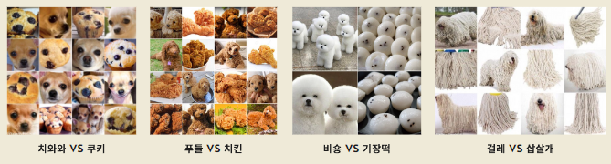

- 목차

* 1. 주제 선정 배경
* 2. 역할 분담
* 3. 머핀 vs 치와와(손예림)
* 4. 치킨 vs 푸들(임소영)
* 5. 기장떡 vs 비숑(이화은)
* 6. 대걸레 vs Mop Dog(명노아)
* 7. 결론
  

###### 역할 분담

|             역할 | 참여인원                       |
| ---------------: | ------------------------------ |
|         주제선정 | 손예림, 이화은                 |
|    Github Readme | 임소영, 명노아                 |
|    데이터 전처리 | 손예림, 임소영, 이화은, 명노아 |
| 전이학습(Resnet) | 임소영, 명노아                 |
|              CNN | 손예림, 이화은                 |
| 최종 결과물 산출 | 손예림, 임소영, 이화은, 명노아 |

### 소주제 개요(개인 항목)

  

    임소영  
  

  
  **1. 데이터 준비**

- 크롬에서 크롤링한 사진 자료와 캐글에서 음식 및 강아지 관련 데이터를 활용하였습니다.

**2. 데이터 전처리 및 DataSet 및 DataLoader 생성**

- 전처리 순서

  - 사진 크기를 (150, 150)으로 조정
  - tensor로 변형
  - 정규화 실시 (mean = 0.5, std = 0.5 로 실시)

- Dataset 분리

  - 비율은 train : valid : test = 0.7 : 0.1 : 0.2로 설정했습니다.

- DataLoader 생성
  - 배치 사이즈는 10으로 설정하여 생성하였습니다.

**3. 모델 생성**

- 전이학습을 실시하였습니다.
- 사전학습된 모델 : Resnet18

**4. train, valid, test 함수 정의**

- optimizer은 Adam으로 설정하였습니다.
- 손실함수는 BCELoss로 설정하였습니다.

**5. 모델 클래스와 함수들을 활용하여 학습 및 검증 실시**

- scheduler 적용 : MultiStepLR

**6. 성능 평가**

- Loss, Accuracy, Precision, Recall, F1_score 값을 통해 성능 평가를 실시했습니다.

**7. Resnet 종류별 성능 비교**

- resnet34, resnet50, resnet101, resnet152를 이용하여 학습 후 각 모델 별 성능을 비교했습니다.

**8. 모델 시연**

- 새로운 외부 데이터를 활용하여 생성된 모델을 시연하였습니다.

  

    이화은 
  

## 개인 주제: 강아지와 기장떡 사진 분류

### 1. 배경

- 인터넷에서 강아지 사진과 유사한 물건의 사진을 쉽게 찾을 수 있음.
- 딥러닝을 사용하여 컴퓨터가 이 두 가지를 구분할 수 있는지 확인해보고자 함.

### 2. 자료 준비

- 크롬 확장자인 Fatkun Batch Download Image를 활용하여 Google, Naver, Daum에서 총 426장의 사진 다운로드.

### 3. 전처리

#### 이미지 전처리

- transforms.Compose를 이용하여 이미지 사이즈를 64x64로 조정
- 이미지를 텐서로 변환
- 이미지를 정규화

#### 폴더 경로 설정

- 학습용 및 테스트용 데이터 경로 설정
- os.path.isdir(폴더경로)를 통해 경로 확인
- ImageFolder(root=폴더경로, transform=변수명)을 이용하여 이미지를 데이터셋으로 불러옴
- .classes를 통해 하위폴더명 확인

#### 데이터 로더 생성

- 플래그 변수를 활용하여 첫 번째 이미지 저장
- 이후 이미지와 라벨 출력

#### 이미지 데이터 시각화

- 사진 색상이 밝게 나오는 문제 발생
- 문제 원인 분석:
- 정규화로 인한 것인가? X
- plt.imshow(np.transpose(img2[i], (1, 2, 0)))에서 (1, 2, 0) 순서를 변경하여도 오류 발생 또는 사진 회전 문제 발생

### 4. 모델 생성

#### CNN 모델

- 모델 구조 정의 후 초기화
- nn.Module의 초기화 메서드 호출
- 합성곱 레이어1 정의 (컬러 사진이므로 in_channels=3으로 설정)
- 합성곱 레이어2 정의
- 풀링 레이어 정의 → 최대 풀링을 사용하여 특징 맵의 크기 축소
- fully connected 레이어 정의 (10*14*14는 합성곱 레이어2의 out_channels와 첫 번째 풀링 레이어를 거친 후의 특징 맵의 크기)
- 실행 디바이스 실행
- GPU 사용 가능 여부 확인
- 최적화 인스턴스 생성 (AdamW 사용)
- Adam 대신 AdamW 사용하여 모델 변경

#### 학습 및 결과

- Epoch [100] Accuracy: 1.0 / Recall: 1.0 / Multiclass Accuracy: 1.0
- 총 확률 0.5로 저조한 결과

#### 모델 저장

### 5. 예측

- 모델 불러오기
- 테스트에 사용할 사진 확인
- 모델에 사진을 넣어 확률과 결과 확인
  

  

    명노아 
  

#### ✅PPT 부분 참고 바람

# 0. 대걸레와 대걸레와 흡사한 쉽독(Sheep Dog)을 분류하는 모델 생성

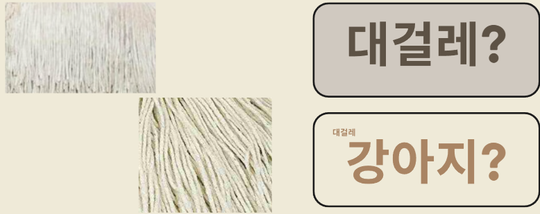

## 1. 전처리

- Chrome 이미지 크롤링 익스텐션을 사용하여 각각 "mop", "mop dog" 이미지를 크롤링 받아옴
- 여러개의 검색 엔진(구글, Yahoo, 네이버, 다음)에서 중복되지 않는 선에서 데이터를 수집  
  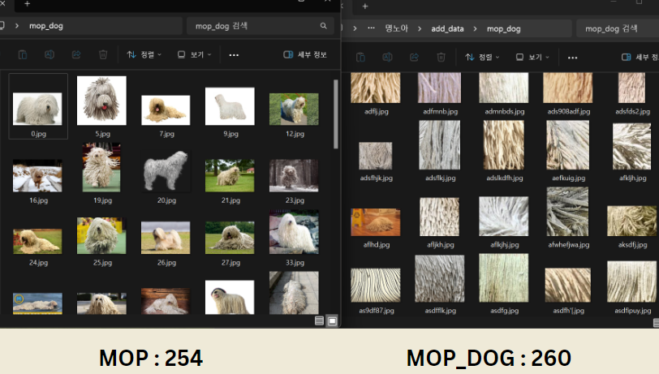

- 마우스 콜백 함수를 사용하여, ROI만을 기존 경로에 저장하도록 수정
- 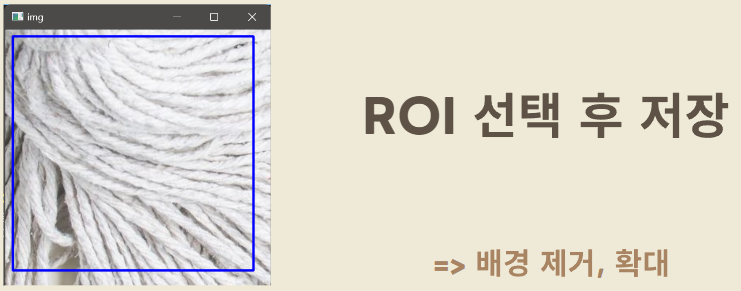

## 2. 모델 생성

- CNN(Convolution Neural Network)  
  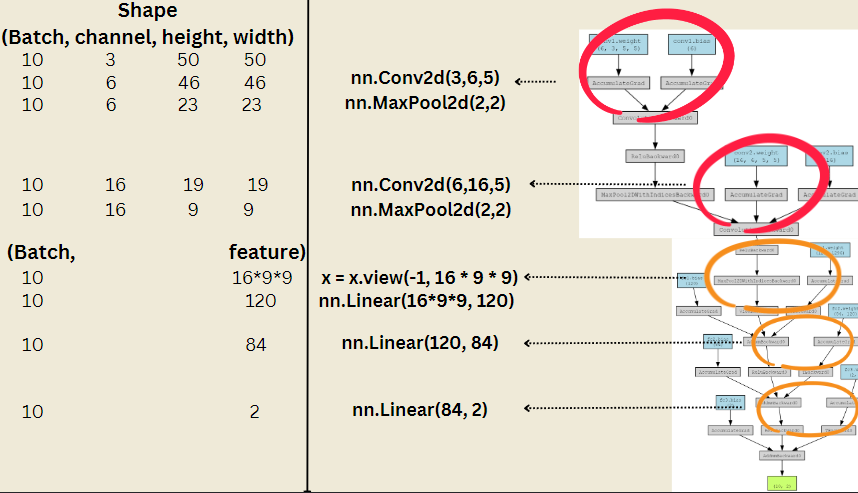
- Transfer learning(Resnet18) : 전이학습으로 import 해서 사용

## 3. 학습 진행

- 옵티마이저(Optimizer) : AdamW
- 손실함수(Loss function) : CrossEntropyLoss
- 배치사이즈(Batch size) : train(10), test(8)
- tqdm 패키지 사용 => progression bar 시각화 사용 📊  
  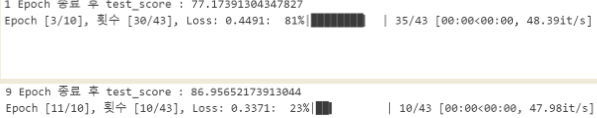

## 4. 학습 도중 분석 : 히스토그램

- Opencv의 cv2.calHist사용

  #### 흑백 히스토그램

  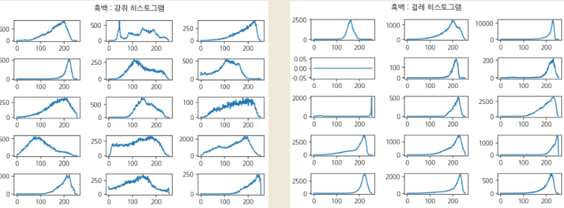
  => 강아지의 사진이 화소 분포 범위가 넓다

  #### 컬러 히스토그램

  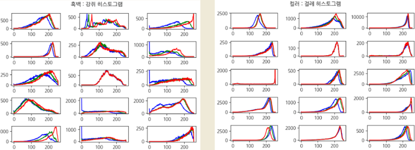
  => 강아지의 사진이 RGB의 분포 차이가 크다

따라서, 색감의 차이가 두드러지도록 촉감을 표현하기 위해 Threshold 사용

#### OTSU 알고리즘

Threshold 사용 => 이미지 전처리 후 사용  
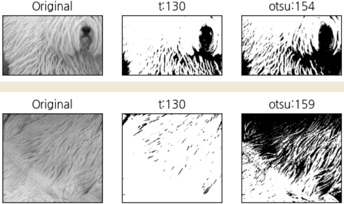

하지만 단일 역치값을 사용하면 강아지의 사진 대부분이 검정으로 처리되어 사용 불가능  
=> Threshold보다 성능이 뛰어난 Adaptive Threshold로 처리  
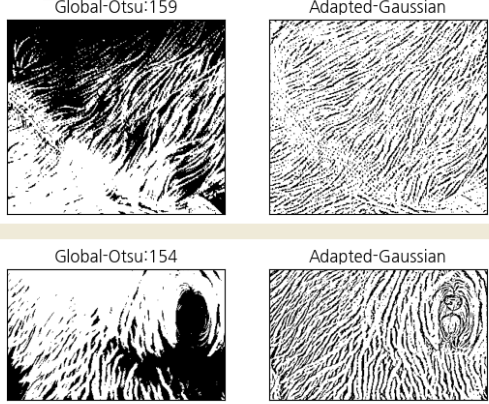

## 5. 결과 분석

1. 일반 CNN 모델 사용  
   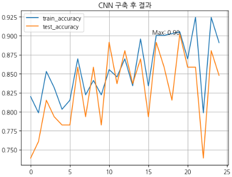
2. 전이학습 : Resnet18 사용  
   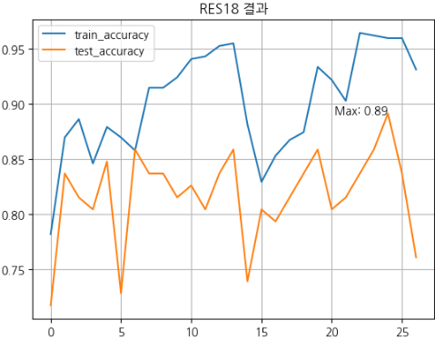
3. Adaptive Threshold 적용  
   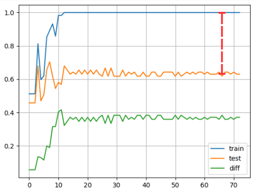
4. Adaptive Threshold 적용 + Dropout + BatchNormalization  
   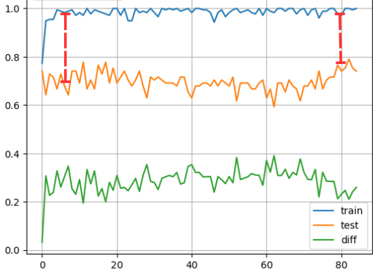
   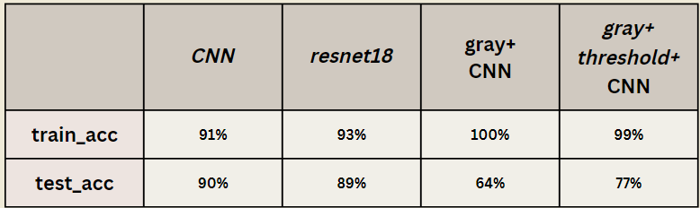

## 6. 결론

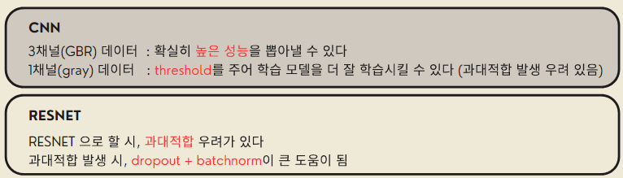

  

  

    손예림 
  

